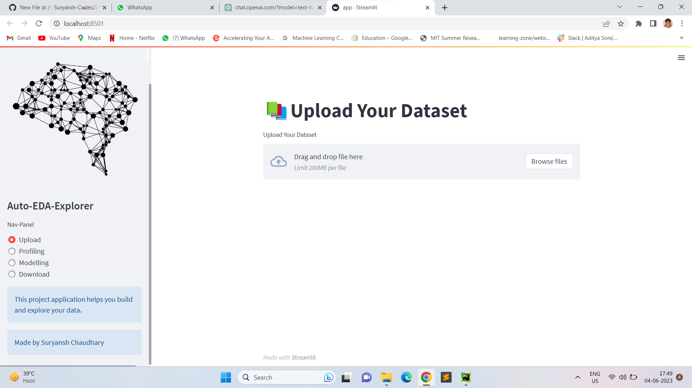
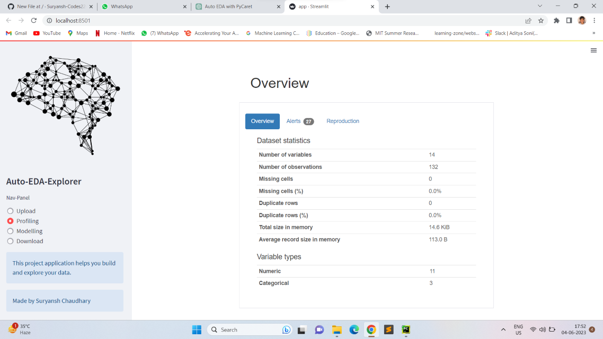
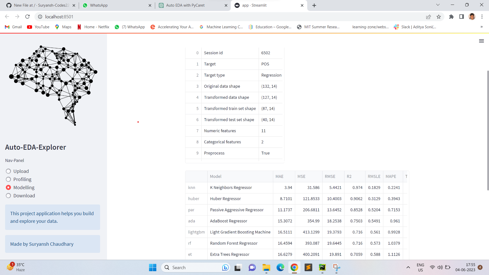

# Auto-EDA-Explorer

# Preview avialable : https://auto-ml-llzq.onrender.com/  (wait for there is 1- min delay in opening so be patient)

# Auto EDA with PyCaret, Pandas Profiling, and Streamlit

This project is an Auto EDA (Exploratory Data Analysis) tool that automates the process of analyzing and visualizing a dataset. It uses PyCaret for data preprocessing and modeling, Pandas Profiling for generating comprehensive data reports, and Streamlit for creating a user-friendly frontend.

## Features

- Automatically performs data preprocessing, including handling missing values, feature encoding, and scaling.
- Generates a detailed data report using Pandas Profiling, including summary statistics, variable correlations, and data quality checks.
- Provides interactive visualizations for better data understanding, including histograms, box plots, scatter plots, and correlation matrices.
- Allows users to select the target variable and perform automated machine learning tasks, such as model training, hyperparameter tuning, and model comparison.
- Offers a user-friendly frontend built with Streamlit, allowing users to easily upload their datasets, customize analysis options, and visualize the results.

## Installation

1. Clone this repository:

2. Change to the project directory:

3. Install the required dependencies using pip:

## Usage

1. Run the Streamlit app:

2. Access the app in your web browser by opening the following URL:

3. Upload your dataset using the file uploader in the app.
4. Customize the analysis options, such as selecting the target variable and choosing the preprocessing steps.
5. Click the "Start Analysis" button to begin the Auto EDA process.
6. Explore the generated data report and visualizations.
7. Perform automated machine learning tasks, such as training models and comparing performance.

## Screenshots

*Homepage of the Auto EDA tool.*

*Generated data report using Pandas Profiling.*

*Interactive visualizations for data exploration.*

## Contributing

Contributions are welcome! If you find any bugs or have suggestions for improvement, please open an issue or submit a pull request. Make sure to adhere to the [Code of Conduct](CODE_OF_CONDUCT.md).

## License

This project is licensed under the [MIT License](LICENSE).

